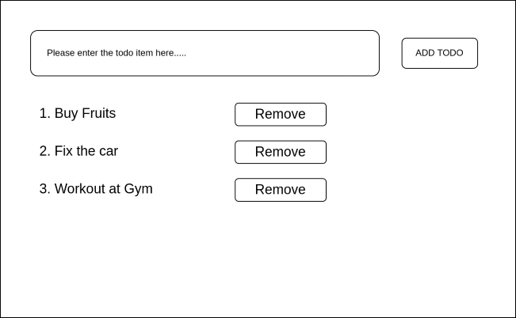

# Problem Statement: Create a TODO List Application

### Use below image for UI visualisation and understanding the problem

 

### Requirements:

 - When a User enters Todo item into the input box, and presses the "Add Todo" button, the Todo item goes in the list below
 - Do not allow a blank Todo item to be filled in the list
 - Make an ordered list and maintain the count
 - Each Todo item in the list will have a "Remove" button in front of it
 - On Clicking the "Remove" Button, that particular item is removed from the list
 - After the removal,the ordered list should arrange itself in order, and there should be no missing numbers
 - Use Bootstrap Grid for aligning UI elements
 - You are allowed to use Bootstrap components
 - Use your UX ideas to make the application responsive for mobile screens