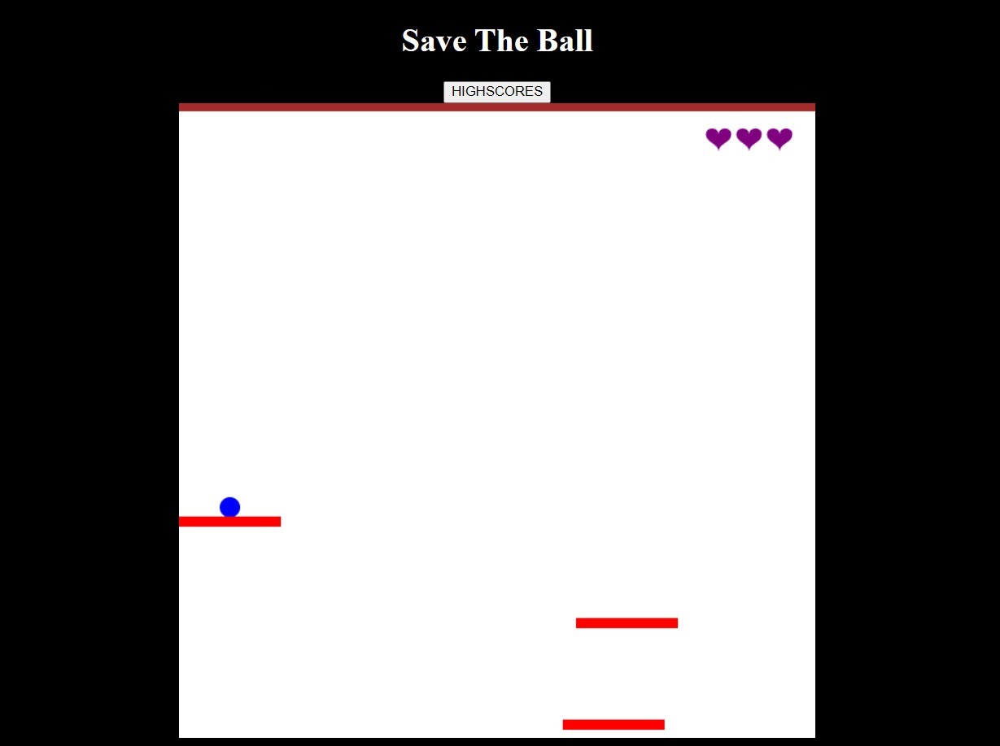

### SAVE THE BALL :

**Game Screenshot:**

**About the game:**
  * User has control over the ball.
  * User has to move the ball accordingly to save the ball from falling.
  * User has 3 lives represented in the right corner of the page.
  * If the user runs out of lives, IT'S GAME OVER.