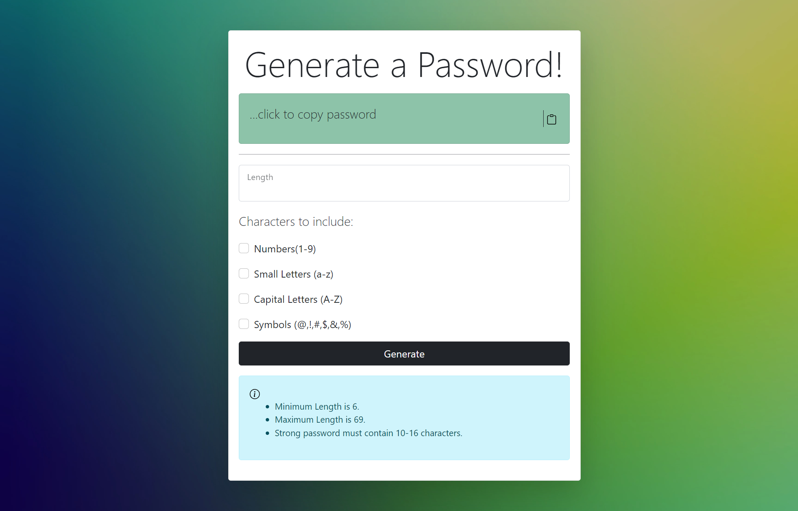

# Strong Password Generator

As we know, in today's world our whole life is online, so a strong password is very much required to safeguard our personal information on various sites and for this very purpose I created this web app to generate highly secure passwords using a combination of **ASCII** charaters which anybody can use anywhere.

This app is build using vanilla JavaScript. It creates a highly random and secure password using all the allowed **ASCII** characters for password generation.
For styling, I have used **Bootstrap 5**. It is also _mobile responsive_.

You can visit the app [here](https://generateapassword.web.app/).

